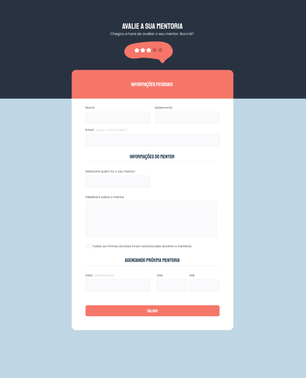

# Criando formulário II | Explorer Stage 3

### Essa tarefa faz parte do curso Explorer da [Rocketseat](https://www.rocketseat.com.br).

Nessa atividade foi criado um novo formulário mantendo foco em:

- Novos conceitos de tags HTML, como input e label;
- Novos conceitos em CSS com ênfase na customização e destaque do  header, inputs e botão;

Também foi utilizado novos conceitos como:

- Campo select;
- Campo checkbox;
- Imagem centralizada no header.

## 🔖 Layout 

Figma do projeto disponível nesse [Link](<https://www.figma.com/file/bB4ys5fpZuecrxDZA6eFf6/Stage-03---Formul%C3%A1rio-avan%C3%A7ado-(Copy)?node-id=15%3A58&mode=dev>).

## 👩‍💻 Demonstração 

Caso deseje visualizar o funcionamento do formulário, basta clicar neste [link](<https://codepen.io/Dayane-Fernandes/pen/WNPPrPV>).